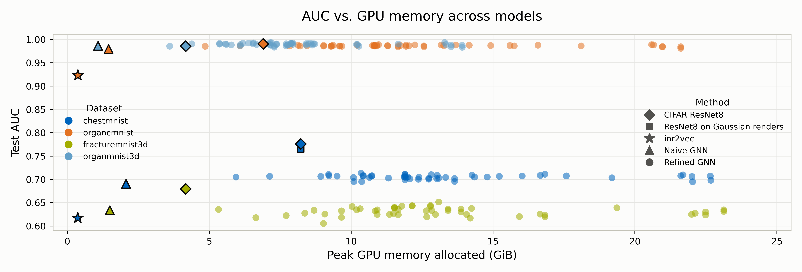
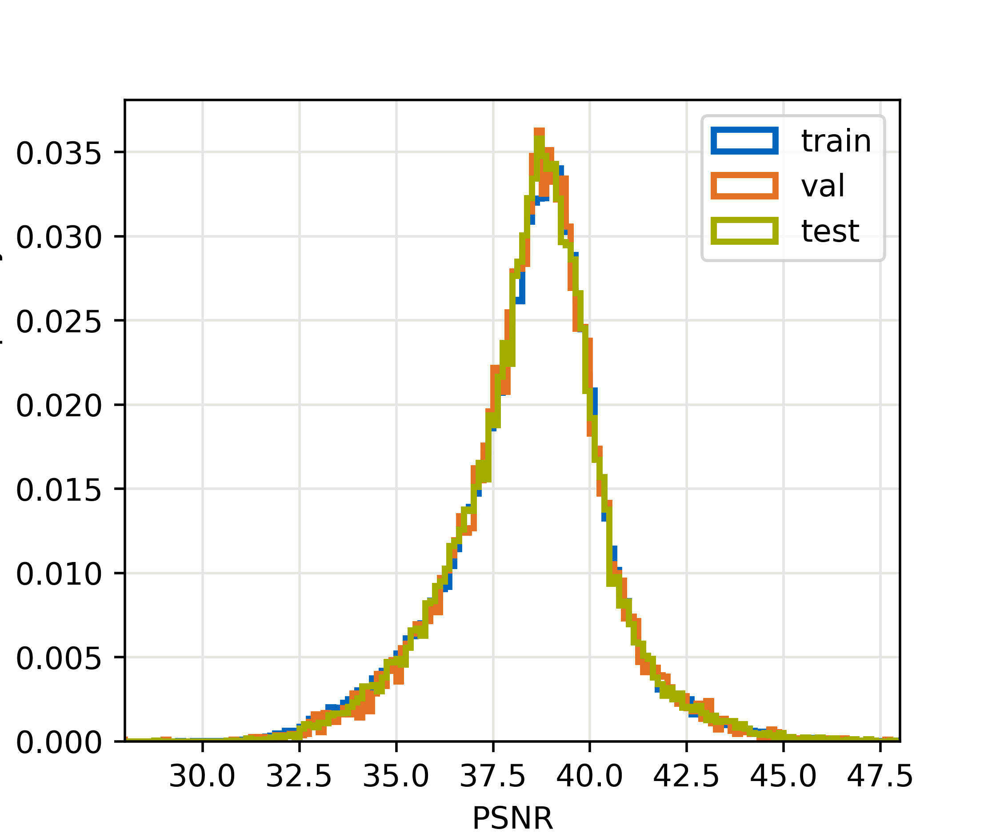
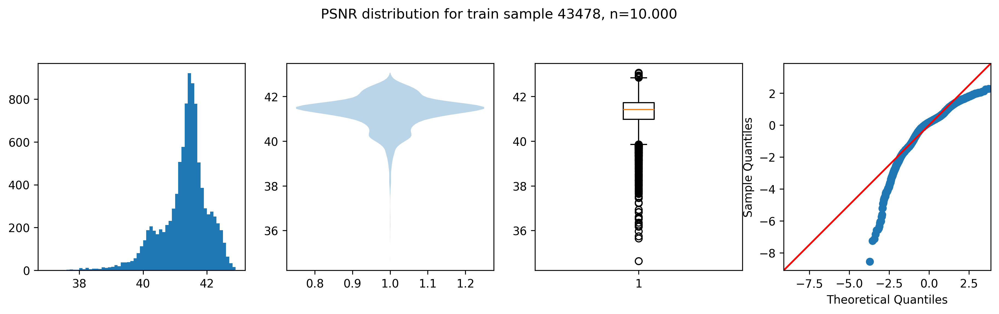

# Classification on Gaussian Representations with Graph Neural Networks

Maximilian Böhmichen · Dominik Hack · Yiyang Qian
Supervisor: Nil Stolt-Ansó — ADLM SS2026, Technische Universität München · TUM AIM Lab

## Topic

Image classification with CNNs operates directly on pixel grids, so GPU memory scales with
resolution and dimensionality — 4D data is effectively out of reach, and memory bottlenecks
constrain batch size, model capacity, and input size.

**Research question:** can we classify from a compressed representation instead of the full
pixel grid, saving memory while maintaining performance?

Naive downsampling loses too much information. Instead we use **Gaussian Splatting (GS)**:
each image is represented as a point cloud of anisotropic Gaussian primitives (position,
scaling, rotation, color). Since #Gaussians ≪ #Pixels, this is a compact representation.
GNNs are a standard architecture for point clouds, so each Gaussian's parameters become a
node feature vector, a KNN graph connects the Gaussians, and a GNN classifies the graph.

```
Image → GS compression → Gaussian graph → GNN → Prediction
```

Datasets are MedMNIST v2: ChestMNIST (chest X-ray, multi-label, 14 classes, 224²),
OrganCMNIST (abdominal CT, 11 classes, 224²), OrganMNIST3D (11 classes, 64³) and
FractureMNIST3D (extremity CT, 3 classes, 64³).

## The results



Test AUC against peak GPU memory allocated, color by dataset and marker by method, over all
our runs — small dots are the sweep, outlined markers the reference points from the
[results table](#results). This is the central figure, and the shape of it is the finding:
the **naive GNN (triangles) sits far left**, with lower AUC than ResNet8 baseline at
a fraction of the memory, while the **refined GNN (circles) drifts right** across 5–23 GiB
without buying proportional AUC — geometry-aware message passing helps a bit, but current designs
are too expensive. **inr2vec (stars)** is leftmost and has even lower performance. The sections below explain
what those models are and how to run them.

Per dataset, OrganC and Organ3D saturate near 0.99 for everything, whereas ChestMNIST
(~0.71 for the GNNs vs 0.776 for ResNet8) and FractureMNIST3D (~0.63) are where the gap
actually lives: complex, high-frequency, class-imbalanced images. Memory logging is
sensitive to the measurement setup and PyG itself may add overhead, so read the relative
positions, not the absolute values. Performance on FractureMNIST3D may additionally be
impaired by preprocessing.
However, rendering an image of the Gaussian Primitives seems to retain almost all performance.

## Preprocessing

Convert a MedMNIST dataset into per-image `.pt` files holding a `torch_geometric.data.Data`
object (`x` = node features, `pos` = positions, `edge_index` = KNN edges, `y` = label,
`psnr` = reconstruction quality). Output layout: `data/{dataset}/{split}/{index:05d}.pt`.
The run is resumable — existing files are skipped.

Every dataset was preprocessed with the default arguments below, with one exception: the 3D
datasets use `--k-graph 31` instead of 15, to stay above the `k = 27` we later used in the
3D GNNs.

```
$ uv sync
$ python preprocess_dataset.py --dataset chestmnist --splits train val test
$ python preprocess_dataset.py --dataset organmnist3d --splits train val test --k-graph 31

  --dataset STR             MedMNIST dataset flag                 [chestmnist]
  --splits STR [STR ...]    Splits to process                 [train val test]
  --output-dir PATH         Root of the .pt tree                        [data]
  --k-graph INT             Neighbors per Gaussian in the KNN graph —     [15]
                            we used 15 for 2D, 31 for the 3D datasets
  --compression-factor F    #Gaussians relative to #pixels — the          [0.1]
                            compression ratio the whole approach rests on
  --max-epochs INT          GS optimization steps per image; lower for a [500]
                            quick smoke test (e.g. 50)
  --logging-dir PATH        Per-image training logs (progress images,   [None]
                            ellipses); leave unset for throughput
  --start-idx INT           First image index, inclusive                   [0]
  --end-idx INT             Last image index, exclusive — with           [None]
                            --start-idx this shards one split across
                            parallel jobs
```

## Baselines (`src/baseline`)

Run via `PYTHONPATH=src uv run python -m baseline.main --model <name> ...`. Three families
are registered under `--model`:

- **`resnet8`** — CIFAR-style ResNet8 (~75k parameters) trained on the original pixel grid.
  The established reference; our GNNs are comparable in parameter count.
- **`resnet8_3d`** — the 3D variant, used for OrganMNIST3D and FractureMNIST3D.
- **`inr2vec_paper` (/ `inr2vec_input` / `inr2vec_full`)** — the implicit-neural-representation
  baseline, our compression reference. Similar in size to the Gaussian representation, it
  requires the least memory of everything we ran but performs worse, while taking longer than GS to preprocess.

Passing `--gaussian-root` makes a ResNet8 train on images *rendered back* from the Gaussian
graphs instead of the raw pixels — this is what isolates how much signal the compression
preserves. `--inr-root` points at the fitted INRs for the inr2vec models.

All reported runs use **100 epochs**, and an effective batch size of **128 for the 2D
datasets** and **16 for the 3D ones**. Note that the parser defaults do *not* match that
convention — `--batch-size` defaults to 16 — so pass it explicitly:

```
$ PYTHONPATH=src uv run python -m baseline.main \
      --model resnet8 --dataset chestmnist \
      --epochs 100 --batch-size 128 --accum-batch-size 128 --wandb

  --model NAME              resnet8 | resnet8_3d | inr2vec_paper |  [required]
                            inr2vec_input | inr2vec_full
  --dataset STR             MedMNIST dataset flag                 [chestmnist]
  --image-size INT          Dataset image size                           [224]
  --epochs INT              Epoch budget; we ran 100 throughout          [100]
  --patience INT            Early-stopping patience on validation AUC    [100]
  --lr FLOAT                Constant learning rate for AdamW            [1e-3]
  --batch-size INT          Minibatch size — set 128 (2D) / 16 (3D)       [16]
  --accum-batch-size INT    Effective batch size via gradient             [128]
                            accumulation. Must be a multiple of --batch-size; set both
                            equal to disable accumulation
  --gaussian-root PATH      Dir with {split}/*.pt graphs. When set, the [None]
                            model trains on images rendered back from the
                            Gaussians instead of the raw pixel grid
  --gaussian-k INT          Nearest Gaussians blended per pixel when      [15]
                            rendering
  --gaussian-cache          Cache rendered images in memory as uint8     [off]
                            after first access — per worker, so peak RAM
                            scales with --num-workers
  --inr-root PATH           Dir with the fitted INRs (inr2vec models)   [None]
  --output-dir PATH         Checkpoints go to                           [data]
                            {output-dir}/models/{model}/{run-name}
  --seed INT                                                          [848577]
  --num-workers INT         DataLoader workers                             [1]
  --run-name STR            Defaults to the current timestamp      [timestamp]
  --wandb                   Enable W&B logging                           [off]
  --wandb-project STR                                          [ADLM-baseline]
  --wandb-tag STR           Repeat to add multiple tags                    [[]]
```

On the cluster, `scripts/baseline.sh` wraps this — it takes the whole CLI as one quoted
string and handles `uv sync` plus `PYTHONPATH`:

```
$ sbatch scripts/baseline.sh "--model resnet8 --dataset chestmnist --epochs 100 \
      --batch-size 128 --accum-batch-size 128 --wandb"
```

`scripts/run_inr2vec.sh <dataset> [extra args]` is the inr2vec equivalent, with the
100-epoch / 128-vs-16 convention already wired in (it picks the batch size from whether the
dataset name contains `3d`) and `--inr-root` pointed at the fitted INRs.
`scripts/trainResNet8.sh` is a fixed ResNet8 invocation.

## GNNs (`train_gnn.py`)

Both models deliberately mirror ResNet8 stage for stage, so that the only real difference is
what the data looks like — pixel grid vs Gaussian graph — and the comparison stays
parameter-matched:

| ResNet8 | Our GNNs |
| --- | --- |
| 3×3 conv stem + BN + ReLU | graph conv stem + LN + ReLU |
| 3 residual blocks of 3×3 convs, BN, skip + ReLU | residual blocks of graph convs, LN, skip + ReLU |
| global average pooling | global mean pooling |
| FC classifier | FC classifier |

The convolution is the one swapped part: a 3×3 kernel aggregates a fixed pixel neighborhood,
a graph conv aggregates the K nearest Gaussians. Both are selected with `--model`:

- **`simple` — Naive GNN** (`src/model/gnn_other.py`, plain PyTorch). For each node, accumulate
  the features of its K nearest neighbors. No geometry-aware edge weighting; same head as
  ResNet8. This is our most memory-efficient model.
- **`pyg` — Refined GNN** (`src/model/gnn_another.py`, PyTorch Geometric). Builds on the naive
  version and makes message passing geometry-aware: per edge it computes geometric descriptors
  (relative position, distance, scaling, rotation relation), feeds them through a shared MLP
  to get mixing coefficients over `--num-bases` shared bases, and sum-aggregates the resulting
  messages. Supports relative positions via Random Fourier Features (`--rff-features`),
  frame rotation (`--rotate-frame`), and Mahalanobis instead of L2 KNN edges
  (`--neighbor-distance mahalanobis`), which accounts for scale, shape and orientation rather
  than center-to-center proximity alone.

What that shared MLP is really doing is re-learning what a pixel grid hands a CNN for free.
A 3×3 kernel can afford one fixed weight per neighbor because the grid guarantees the
geometry: every pixel is the same size, spacing is uniform, and each neighbor's relative
position is known in advance and identical everywhere in the image. A Gaussian point cloud
gives up all three — primitives differ in scale, shape and orientation, and sit at arbitrary
offsets — so the geometry has to become an *input* rather than an assumption. The MLP maps
those per-edge descriptors to mixing coefficients, i.e. it derives the weights the grid would
have given implicitly. It is the same idea made continuous: the kernel is no longer 9 fixed
taps, but a function evaluated at whatever relative position a neighbor happens to occupy.
The catch is the price — that per-edge machinery is exactly what pushes the refined GNN's
memory past ResNet8. **However, it notably doesn't scale with larger input sizes/images.**

As with the baselines, all reported runs use **100 epochs** and batch size **128 for the 2D
datasets, 16 for the 3D ones** — the parser defaults to 50 epochs, so pass both explicitly:

```
$ python train_gnn.py --dataset chestmnist --data-root /path/to/data \
      --model pyg --epochs 100 --batch-size 128 --in-memory --num-workers 4

  --dataset STR             MedMNIST dataset flag. "3d" in the name [chestmnist]
                            switches spatial dim 2→3, rotation to a
                            quaternion, and k from 9 to 27
  --data-root PATH          Parent dir containing {dataset}/{split}/*.pt [data]
  --model {pyg,simple}      pyg = refined (SumConv, basis-decomposed),   [pyg]
                            simple = naive (KNNConv)
  --epochs INT              We ran 100 throughout                         [50]
  --batch-size INT          128 for 2D, 16 for 3D                        [128]
  --lr FLOAT                AdamW, cosine-annealed to 1e-6              [1e-3]
  --weight-decay FLOAT      AdamW L2 regularization                     [1e-4]
  --hidden INT              Hidden width                                  [64]
  --layers INT              Number of residual blocks                      [3]
  --num-bases INT           Shared bases in the refined convolution (pyg   [8]
                            only) that edge-specific coefficients mix
  --neighbor-distance       KNN graph metric. mahalanobis accounts for    [l2]
      {l2,mahalanobis}      scale, shape and orientation rather than
                            center-to-center proximity alone
  --flow-direction          Edge direction                      [propagate_to]
      {propagate_to,propagate_from}
  --rff-features INT        Random Fourier Features on relative positions  [0]
                            (0 = off)
  --rff-sigma FLOAT         RFF bandwidth                                [1.0]
  --rotate-frame            Rotate the local frame per node              [off]
  --max-samples INT         Cap dataset size — 32 overfits a single     [None]
                            batch as a sanity check
  --in-memory               Force in-memory dataset (auto-on for        [auto]
                            pneumoniamnist)
  --num-workers INT         DataLoader workers              [4, or 0 on macOS]
  --seed INT                                                              [42]
  --wandb-project STR                                    [adlm-gnn-classifier]
  --wandb-entity STR                                                    [None]
  --wandb-mode              Use "disabled" for local runs             [online]
      {online,offline,disabled}
```

`scripts/gnn.sh` is the cluster driver: it appends its quoted argument string to four fixed
invocations, one per dataset, already applying `--epochs 100`, `--in-memory`, and
`--batch-size 16` for the two 3D datasets — so a single submission sweeps everything:

```
$ sbatch scripts/gnn.sh "--model pyg --hidden 64 --layers 3"
```

Feature statistics are computed once from the training split and cached under
`cache/{dataset}/`; for multi-label datasets the BCE `pos_weight` is cached alongside.
Final test AUC/ACC go through the official MedMNIST `Evaluator`, with a torchmetrics
fallback when only part of a split has been preprocessed.
Input features are normalized as much as possible.

## Results

Test AUC (higher is better) and peak GPU memory in GiB (lower is better):

| Data | AUC: ResNet8 | Naive | Refined | inr2vec | Mem: ResNet8 | Naive | Refined | inr2vec |
| --- | --- | --- | --- | --- | --- | --- | --- | --- |
| Chest | **.776** | .690 | .712 | .655 | 5.12 | **2.22** | 6.38 | 0.37 |
| OrganC | **.9997** | .980 | .989 | .923 | 3.87 | **1.56** | 5.22 | 0.37 |
| Organ3D | **1.000** | .986 | .993 | — | 2.41 | **1.16** | 3.87 | — |
| Fract3D | **.672** | .634 | .651 | — | 3.84 | **1.61** | 5.12 | — |

The naive GNN consumes **2–3× less GPU memory** than ResNet8 across all datasets, at a
modest performance loss. The refined GNN recovers AUC but partially spends more memory than
ResNet8. inr2vec needs the least memory of all but classifies worst.

### `scripts/psnr_hist.png` — reconstruction quality of the compression



PSNR distribution over all preprocessed ChestMNIST images, one histogram per split. The
distribution is a tight unimodal bump with median ≈ 38.5 dB, and train, val and test lie
almost exactly on top of each other — the GS compression achieves high reconstruction
quality and does so uniformly across splits, so no split is systematically advantaged and shows the statistical nature of the preprocessing.
Together with the render→ResNet8 experiment (0.767 AUC on Gaussian renders vs 0.776 on the
originals), this says the compression preserves enough discriminative signal, and the
remaining gap to ResNet8 comes from the model rather than from lost information.

### `scripts/43478.png` — the compression is non-deterministic



The same training image (#43478) compressed 10,000 times, shown as histogram, violin, box
plot and normal Q–Q plot. Re-running GS on one fixed image does *not* give one fixed graph:
PSNR spreads over roughly 38–43 dB, peaking near 41.5 dB with a long left tail of worse fits.
The Q–Q plot bends away from the line on the left, so that tail is heavier than Gaussian —
those outliers are runs that converged badly, not symmetric noise. Two readings follow: the
representation of an image is a distribution rather than a point, and that variability is
free data augmentation — multiple GS runs per image yield different graphs of the same
label, one of the possible routes against the overfitting that remains the central GNN challenge.

## Key takeaways

- GS compression + GNN classification trades a small performance loss for a GPU-memory
  decrease while retaining similar model training time.
- The advantage scales with dimensionality and with larger input sizes than analyzed here.
- Compressed Gaussian representations preserve enough discriminative signal for classification.
- Geometry-aware message passing improves performance, but current designs are too expensive.
- The approach is not yet fully optimized — the upper performance limit has not been reached.

## Future outlook

Higher dimensions (4D) and larger resolutions, where the memory advantage grows further;
segmentation, which GNN architectures are naturally suited to; attention-based graph
convolutions (graph transformers for global context); Mahalanobis distance for KNN-graph
creation; data augmentation from the non-determinism of GS; and image-gradient-weighted
initialization to concentrate Gaussians on informative regions.

## Environment

- Python ≥3.12 (pinned in `.python-version`), package manager **uv** (not pip): `uv sync`
- Key dependencies: torch, torch-geometric, faiss-cpu (KNN), kornia, medmnist, wandb
- Cluster job scripts live in `scripts/` (`baseline.sh`, `gnn.sh`, `run_inr2vec.sh`)

## Branches not merged into `main`

Quick reference. Note that `git` reports several of these as unmerged even though their work
*is* in `main` — they were squash-merged as PRs, so the commits differ. Those are marked
below; the rest hold work that only exists on the branch.

| Branch | What it did | Status |
| --- | --- | --- |
| `baseline-rewrite` | The current `src/baseline` package — model registry, CLI, Gaussian-render and inr2vec data paths | In `main` via PR #15 (squashed) |
| `other-gnn` | The refined PyG GNN (`gnn_another.py`) and model switching | In `main` via PR #20 (squashed) |
| `GNN-Debug` | New GNN architectures, Fourier positional encoding — the experimental line that fed `other-gnn` | Largely superseded |
| `other-gnn2` | Earlier refined-GNN iteration, added OrganMNIST3D support | Superseded by `other-gnn` |
| `GNN-Experiments` (remote only) | Numbered GNN experiments plus a linear baseline (`scripts/linear_baseline.py`) | Reference for the sweep |
| `GNN-Classifier` | The original ResGCN classifier and OrganMNIST preprocessing script | Superseded |
| `eda-slurm` | PSNR analysis over multiple GS representations of the same sample — the source of `scripts/43478.png` — and EDA on the cluster | Relevant, unmerged |
| `feat/resnet8-imagenet-adaptation` | `ImageNetResNet8` as an extension of the baseline, with a verification script | Unmerged extension |
| `2DGS-Preprocessing` / `gs-slurm` | Original 2DGS preprocessing; `gs-slurm` is its SLURM/Selene-adapted variant | Superseded by `preprocess_dataset.py` |
| `dataset` / `dataset-update` | `Gaussian2DDataset`, rotation transform, `edge_attr`; lazy loading with retry + backoff | In `main` via PRs #8/#13 |
| `dataset_eda` | Script for the presentation-1 EDA plots (`scripts/presentation1_eda.py`) | Historical |
| `baseline` | First baseline implementation with wandb integration | Superseded by `baseline-rewrite` |

## References

1. J. Yang et al., "MedMNIST v2 — A large-scale lightweight benchmark for 2D and 3D biomedical image classification," Sci. Data, vol. 10, no. 1, p. 41, Jan. 2023.
2. B. Sanchez-Lengeling, E. Reif, A. Pearce, A. B. Wiltschko, "A Gentle Introduction to Graph Neural Networks," Distill, vol. 6, no. 9, p. e33, Sep. 2021.
3. M. Tancik et al., "Fourier Features Let Networks Learn High-Frequency Functions in Low-Dimensional Domains," NeurIPS, 2020.
4. L. De Luigi, A. Cardace, R. Spezialetti, P. Z. Ramirez, S. Salti, L. Di Stefano, "Deep Learning on Implicit Neural Representations of Shapes," ICLR, 2023.
5. Y. Zhang et al., "Image-GS: Content-Adaptive Image Representation via 2D Gaussians," arXiv:2407.01866, 2024.


## Disclosure

Parts of the source code, and much of the scripts, plots, and this README were created responsibly with Claude Code.